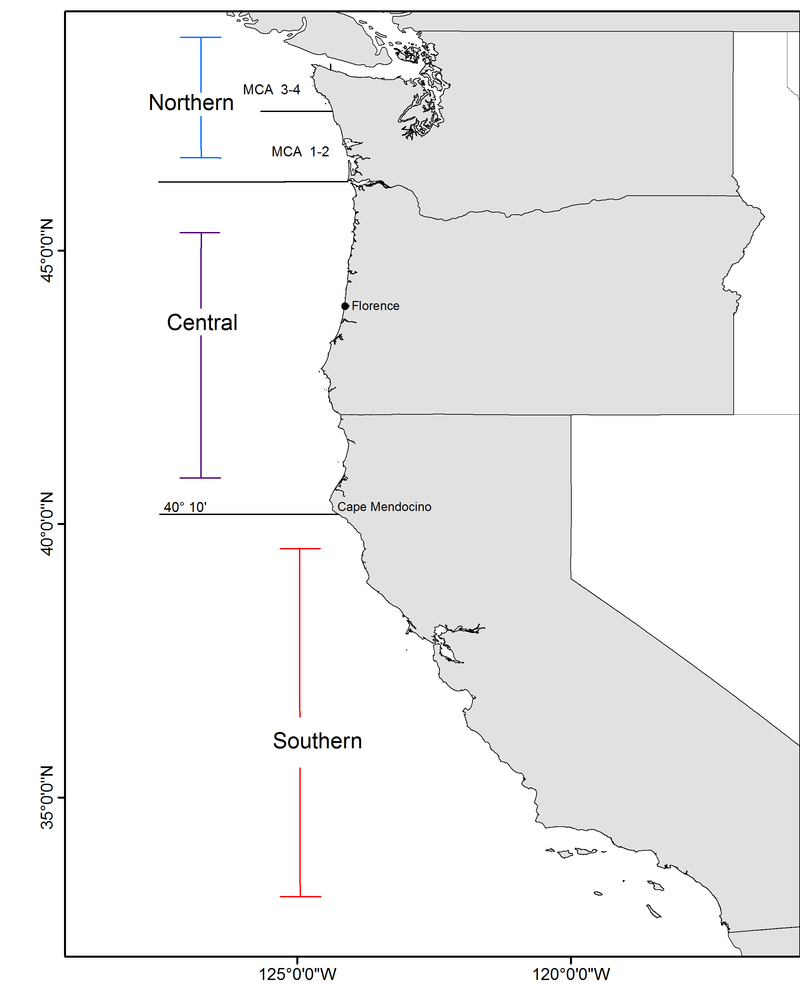

---
output:
  pdf_document: default
  html_document: default
---

#Introduction{-}

##Stock{-}
This assessment reports the status of the `r spp` (\emph{`r spp.sci`}) resource 
in U.S. waters off the West Coast using data through `r LastYR`, updated with catches through 2018 and with projected catches for 2019 and 2020.

The models described in this document apply to the black rockfish (Sebastes melanops) stocks that
reside in the waters from Point Conception (34°27' N latitude) in the south to the U.S. boundary with
Canada (approximately 48°30' N latitude). Following the consensus recommendations from a preliminary
stock assessment workshop in April 2015 (PFMC 2015), the stock assessment team (STAT) decided to
prepare separate geographic stock assessments that are spatially stratified with boundaries at the CA/OR
border (42°00' N latitude) and OR/WA border (46°16' N latitude).

Black rockfish are also caught from the waters off British Columbia and Alaska, but there have not been
any formal assessments of stock status for those areas.

##Catches{-}
Information on historical landings of `r spp` are available back to xxxx...
(Table \ref{tab:Exec_catch}). Commercial landings were small during 
the years of World War II, ranging between `r min(round(Tot.catch.df[Tot.catch.df[,1] >= 1939 & Tot.catch.df[,1] <= 1945,2],0))` to `r max(round(Tot.catch.df[Tot.catch.df[,1] >= 1939 & Tot.catch.df[,1] <= 1945,2],0))` metric  tons (mt) per year.

Black rockfish are caught by a wide variety of gear types and in recent decades have been a very
important target species for recreational charter-boats and private sport anglers in Washington and
Oregon, and to a lesser extent in California. In recent years the recreational fishery has accounted for
most of the black rockfish catches (Figure ES-1 to Figure ES-3). Black rockfish can also be an important
component of nearshore commercial fisheries, either as incidental catch by the troll fishery for salmon or
as directed catch by jig fisheries for groundfish. Further, in California and Oregon there are nearshore
fisheries that catch and sell fish live for the restaurant trade. Washington closed nearshore commercial
fisheries in state water in late 1990’s and never allowed the live-fish fishery to develop. In all states there
have been almost no trawl-caught landings of black rockfish in recent years (Table ES-1), but trawl
landings in the past were substantial (Figure ES-1 to Figure ES-3).


Detailed reports of commercial landings of black rockfish are generally unavailable prior to 1981, when
the Pacific Fishery Information Network (PacFIN) database began. The catch series prior to 1981 for
these assessments were derived by applying available estimates or assumed values for the proportion of
black rockfish landings in reported landings of rockfish. Observer data, which are available only for the
past decade, indicate low levels of discarding of black rockfish, generally less than 2% of total catch.
Because of their nearshore distribution and low abundance compared to other rockfish species, black
rockfish are unlikely to have ever comprised a large percentage of rockfish landings, but it seems quite 
certain that they have been more than a trivial component for many years. Black rockfish were one of
only four rockfish species mentioned by scientific name in reports of rockfish landings in Oregon during
the 1940s, and they were one of only six rockfish species mentioned by scientific name in reports of
rockfish landings in California during the same period. Mentions of black rockfish extend back before the
year 1900 in Washington.

(Figures \ref{fig:Exec_catch1}-\ref{fig:Exec_catch2})  
(Figure \ref{fig:r4ss_catches}) 

Since 2000, annual total landings of `r spp` have ranged between 
`r paste0( min(round(Tot.catch.df[Tot.catch.df[,1] > 2000 & Tot.catch.df[,1] <= Dat_end_mod1,2],0)), '-', max(round(Tot.catch.df[Tot.catch.df[,1] > 2000 & Tot.catch.df[,1] <= Dat_end_mod1,2],0)) )` mt, with landings in `r Dat_end_mod1` totaling `r round(Tot.catch.df[Tot.catch.df[,1] == Dat_end_mod1,2],0)` mt.

##Data and Assessment{-}
This is a catch-only update of the assessment conducted in 2015. The assessment assumes three areas delineated by state borders, as was agreed upon at a pre-assessment and data workshop in March 2015. The current assessment use the same versions of Stock Synthesis 3 as in 2015. The
Washington base-case assessment includes two commercial and a single recreational fleet, and a dockside and tag-based CPUE series.  The Oregon assessment has
three commercial fleets and two recreational fleets, and uses five surveys and an additional research study for biological compositions. California also has three commercial fleets and 1 recreational fleet with three surveys of abundance, all based on recreational fisheries. All three models include length compositions, and conditional age-at-length data.

###Sigma analysis{-}
One purpose of this assessment is to evaluate the effect of increasing the sigma value used to calculate P* buffers as the assessment ages, and the three models were each run with a series of buffers calculated from an increasing sigma.  The Washington and California stocks are Category I stocks, and the models used buffers calculated from the 0.45 value of sigma. For the Oregon model, these were calculated according to the default Category II values.  The timeseries of catches, projections and buffers used for this analysis were all provided by the Groundfish Management Team (GMT) of the Pacific Fishery Management Council (PFMC).

##Ecosystem Considerations{-}
Ecosystem considerations were not explicitly explored in these models, though growth deviations were
considered in the Washington model. While no mechanisms have been put forth for these time-varying
changes in growth, an environmental component is possible. Limited data in Oregon and California also
suggest the possibility that growth has changed over time.

##Unresolved Problems and Major Uncertainties{-}
The most significant uncertainty for all models is the treatment and value of natural mortality and the form of fleet selectivity (e.g., length-based asymptotic vs. age-based dome-shaped selectivity). Data-driven selection between the extreme “kill” (using a ramping of M) or “hide” hypotheses are not currently resolvable. The current California and Washington base models instead use a form of the “kill” hypothesis by not implementing the age-based selectivity (“hide” hypothesis) and estimating female and male natural mortality, thus avoiding a fixing natural mortality as was necessary in the Oregon model.

The Oregon model also contained a step in female natural mortality, a specification not used in the
California or Washington models. Another important issue is the highly uncertain historical time-series of
removals in all states, which needs further consideration. 

The development of fishery-dependent indices of abundance still requires further attention. Steepness, while fixed, is still highly uncertain for rockfishes
and currently is mismatched to the MSY proxy. And while the steepness profile shows low sensitivity in several derived quantities, steepness strongly defines the yield capacity of stocks, and therefore could cause major uncertainty in the recommended management quantities. Stock structure and its relationship
to the current political/management boundaries are also not fully understood, both within U.S. jurisdiction and between the U.S. and Canada. While this is a common challenge faced in most west coast stock assessments, further improvement on this issue will likely rely on black rockfish-specific data.


##Research and Data Needs{-}
Recommended avenues for research to help improve future black rockfish stock assessments:

\begin{enumerate}

\item \textbf{Movement}: Further investigation into the movement and behavior of older (> age 10) females to reconcile their absence in fisheries data. If the females are currently inaccessible to fishing gear, can we determine where they are?

\item \textbf{Mortality}: Appropriate natural mortality values for females and males will help resolve the extent to which dome-shaped age-based selectivity may be occurring for each.

\item \textbf{Historical Catch}:  All states need improved historical catch reconstructions. The trawl fishery catches in particular require attention. Given the huge historical removals of that fleet in each state, the assessment is very sensitive to the assumed functional form of selectivity. A synoptic catch reconstruction is recommended, where states work together to resolve cross-border catch issues as well as standardize the approach to catch recommendations.

\item \textbf{Uncertainty}: Identifying stanzas or periods of uncertainty in the historical catch series will aid in the exploration of catch uncertainty in future assessment sensitivity runs.

\item \textbf{Habitat}: The ODFW tagging study off Newport should continue and be expanded to other areas. To provide better prior information on the spatial distribution of the black rockfish stock, further work should be conducted to map the extent of black rockfish habitat and the densities of black rockfish residing there.

\item \textbf{Survey}:  An independent nearshore survey should be supported in all states to avoid the reliance on fishery-based CPUE indices.

\item \textbf{Stock Structure}:  Stock structure for black rockfish is a complicated topic that calls for further analysis. How this is determined (e.g., exploitation history, genetics, life history variability, biogeography, etc.) and what this means for management units needs to be further refined. This is a general issue for all nearshore stocks that likely have significant and small scale stock structure among and within states, but limited data collections to support small-scale management.

\end{enumerate}

#Executive summary for the California Model{-}

\FloatBarrier

<!-- ***********BEGIN EXECUTIVE SUMMARY CATCH FIGURES AND TABLES*********** -->
<!-- ***********Edit the Plot_catch tables and captions******************** -->
<!-- ***********This depends on how many plots you need******************** -->
<!-- ***********Also included is the r4SS plot - keep or remove************ -->
<!-- ***********CATCH FIGURES********************************************** -->
```{r, fig.cap= paste(spp, 'catch history for the CA recreational fleets. \\label{fig:Exec_catch1}',sep=' ')}
    # CSV: './txt_files/Exec_catch_for_figs.csv'
    # Note: you cannot have carriage returns in the R options line
    # Plot CA catches           
    Plot_catch(Catch_df = Exec_region1_catch)
```


\FloatBarrier


<!-- ***********CATCH TABLE************************************************ -->
```{r, results='asis'}
    #CSV: './txt_files/Exec_catch_summary.csv'
    # Catch table section in R_exec_summary_fig_tables.R
    # Print the table
    print(Exec_catch.table1, include.rownames = FALSE, caption.placement = 'top')
```
<!-- ***********END EXECUTIVE SUMMARY CATCH FIGURES AND TABLES************* -->
\FloatBarrier

\newpage


\FloatBarrier

##Stock Biomass{-}
(Figure \ref{fig:Spawnbio_all} 
and Table \ref{tab:SpawningDeplete_mod1}). 

The `r LastYR` estimated spawning biomass relative to unfished 
equilibrium spawning biomass is above the target of 40% of unfished spawning biomass at `r Depl_mod1` 
(95% asymptotic interval: $\pm$ `r Depl_mod1_CI`) (Figure \ref{fig:RelDeplete_all}). 
Approximate confidence intervals based on the 
asymptotic variance estimates show that the uncertainty in the estimated spawning biomass is high.

\FloatBarrier

<!--BEGIN  EXECUTIVE SUMMARY SPAWNING BIOMASS AND DEPLETE TABLES AND FIGURES-->
```{r, results='asis'}
    # Print spawning biomass table(s)
    print(Spawn_Deplete_mod1.table, include.rownames = FALSE, caption.placement = 'top')
    
    # Select which file to use for the recuitment figure, depending on if you have one model or multiple models
      spawn.file  = ifelse(fecund=='numbers',
                           'r4ss/plots_mod1/ts7_Spawning_output_with_95_asymptotic_intervals_intervals.png',
                           'r4ss/plots_mod1/ts7_Spawning_biomass_(mt)_with_95_asymptotic_intervals_intervals.png')
      Bratio.file = 'r4ss/plots_mod1/ts9_Spawning_depletion_with_95_asymptotic_intervals_intervals.png' 
```

\FloatBarrier


<!-- ***********END  EXECUTIVE SUMMARY SPAWNING BIOMASS AND**************** -->


<!-- ***********DEPLETION TABLES AND FIGURES******************************* -->

\FloatBarrier


##Recruitment{-}
Recruitment deviations were estimated from xxxx-xxxx (Figure \ref{fig:Recruits_all} and 
Table \ref{tab:Recruit_mod1}).


<!-- ***********BEGIN EXECUTIVE SUMMARY RECRUITMENT TABLES AND FIGURES***** -->
```{r, results='asis'}
   # Print recruitment tables; will print up to 3 depending on the number of models, you can delete the code
   # for models you don't need as well
   print(Recruit_mod1.table, include.rownames = FALSE, caption.placement = 'top')
   
   # select which file to use for the recuitment figure, depending on if you have one model or multiple models
   
     recruit.file  = 'r4ss/plots_mod1/ts11_Age-0_recruits_(1000s)_with_95_asymptotic_intervals.png'
    
```

\FloatBarrier


<!-- ***********END EXECUTIVE SUMMARY RECRUITMENT TABLEs AND FIGURES******* -->

 \FloatBarrier


##Exploitation status{-}
Harvest rates estimated by the base model .....
management target levels (Table \ref{tab:SPR_Exploit_mod1} and Figure \ref{fig:SPR_all}). 


\FloatBarrier

<!-- ***********BEGIN EXECUTIVE SUMMARY EXPLOITATION AND******************* -->
<!-- ***********SPRratio TABLE AND FIGURES********************************* -->
```{r, results='asis'}
   # Print exploitation and SPRratio tables depending on how many models there are
   
     print(SPRratio_Exploit_mod1.table, include.rownames = FALSE, caption.placement = 'top')
   
   # select the files for the SPR and phase plots depending on the number of models
   
     SPR.file   = 'r4ss/plots_mod1/SPR2_minusSPRseries.png'

   
```

\FloatBarrier


<!-- ************END EXECUTIVE SUMMARY EXPLOITATION************************ -->
<!-- ************AND SPRratio TABLE AND FIGURES**************************** -->

\FloatBarrier


##Reference Points{-}

This stock assessment estimates that `r spp` in the `r mod1_label` is 
`r ifelse(Deplete_mod1[nrow(Deplete_mod1),2]-MT>0,"above","below")` the biomass 
target ($SB_{40\%}$), and well `r ifelse(Deplete_mod1[nrow(Deplete_mod1),2]-MSST>0,"above","below")` 
the minimum stock size threshold ($SB_{25\%}$). The estimated relative depletion level for the base 
model in `r LastYR+1` is 
`r Depl_mod1` (95% asymptotic interval: $\pm$ `r Depl_mod1_CI`, corresponding 
to an unfished spawning biomass of `r paste(Spawn_mod1, fecund_unit,sep=' ')` 
(95% asymptotic interval: `r paste(Spawn_mod1_CI, fecund_unit, sep=' ')`) of 
spawning biomass in the base model (Table \ref{tab:Ref_pts_mod1}).  Unfished 
age `r min_age` biomass was estimated to be `r Ref_pts_mod1[2,2]` mt in the 
base case model. The target spawning biomass ($SB_{40\%}$) 
is `r paste(Ref_pts_mod1[7,2], fecund_unit,sep=' ')`, which corresponds with an 
equilibrium yield of `r Ref_pts_mod1[10,2]` mt. Equilibrium yield at the proxy $F_{MSY}$ 
harvest rate corresponding to $SPR_{50\%}$ is `r Ref_pts_mod1[15,2]` mt (Figure \ref{fig:Yield_all}).


\FloatBarrier

<!-- ***********BEGIN EXECUTIVE SUMMARY REFERENCE POINT TABLES************* -->
```{r, results='asis'}
   # Print reference point tables
  
     print(Ref_pts_mod1.table, include.rownames = FALSE, caption.placement = 'top',
           sanitize.text.function = function(x){x})
   
```
<!-- ***********END EXECUTIVE SUMMARY REFERENCE POINT TABLES*************** --> 

\FloatBarrier


##Management Performance{-}

Table \ref{tab:mnmgt_perform}


<!-- ***********BEGIN EXECUTIVE SUMMARY MANAGEMENT PERFORMANCE TABLE******* --> 
```{r, results='asis'}
    # Print management performance table - will have to edit the text file and 
    # R code for this table
    # Edit file: './txt_files/Exec_mngmt_performance.csv'
    print(mngmnt.table1, include.rownames = FALSE, caption.placement = 'top', 
          sanitize.text.function = function(x){x}, scalebox = .9)
```
<!-- ***********END EXECUTIVE SUMMARY MANAGEMENT PERFORMANCE TABLE********* -->


\FloatBarrier


##Decision Table{-}    


              


<!-- ***********BEGIN EXECUTIVE SUMMARY OFL AND DECISION TABLES************ -->
```{r, results='asis'}   
    # Print OFL table 
      print(OFL.table1, include.rownames = FALSE, caption.placement = 'top')

   # Decision tables currently read in as txt files and will need to be changed
   # Decision table text set up for alternate states of natural mortality, but 
   # the text can be changed in the Decision Table section of the R file, 
   # R_exec_summary_figs_tables.R
   # Edit text file(s): ./txt_files/DecisionTable_mod1
    # print Model 1 decision table
    print(decision_mod1.table, add.to.row = addtorow, include.rownames = FALSE, 
          caption.placement = 'top', 
          hline.after = c(-1, 0, 10, 20, 30, nrow(decision_mod1.table)), 
          scalebox = .85)
```
<!-- ***********END EXECUTIVE SUMMARY OFL AND DECISION TABLES************** -->


<!-- ***********BEGIN EXECUTIVE SUMMARY RESULTS SUMMARY TABLE --> 
```{r, results='asis'}
   # Print the results summary table, will have to edit the R code and input file 
   # depending on the stock structure
   # Edit file: ./txt_files/Exec_basemodel_summary.csv and the Summary Results 
   # section in R code R_exec_summary_figs_tables.R
  
 print(base_summary.table1, 
       include.rownames = FALSE, 
       caption.placement = 'top',
       floating.environment = 'sidewaystable', 
       sanitize.text.function = function(x){x}, 
       scalebox = .6, 
       align = TRUE, 
       hline.after = c(-1, 0, 4, 5, 7, 9, 11, nrow(base_summary.table1)))
```


<!-- ***********END EXECUTIVE SUMMARY RESULTS SUMMARY TABLE AND YIELD CURVE -->

\FloatBarrier

\newpage

#Executive summary for the Oregon Model{-}


\FloatBarrier

<!-- ***********BEGIN EXECUTIVE SUMMARY CATCH FIGURES AND TABLES*********** -->
<!-- ***********Edit the Plot_catch tables and captions******************** -->
<!-- ***********This depends on how many plots you need******************** -->
<!-- ***********Also included is the r4SS plot - keep or remove************ -->
<!-- ***********CATCH FIGURES********************************************** -->


```{r, fig.cap=paste('Stacked line plot of', spp,' catch history for the commercial fleets. \\label{fig:Exec_catch2}',sep=' ')}
    # Plot Oregon catches
    Plot_catch(Catch_df = Exec_region2_catch)
```


\FloatBarrier


<!-- ***********CATCH TABLE************************************************ -->
```{r, results='asis'}
    #CSV: './txt_files/Exec_catch_summary.csv'
    # Catch table section in R_exec_summary_fig_tables.R
    # Print the table
    print(Exec_catch.table2, include.rownames = FALSE, caption.placement = 'top')
```
<!-- ***********END EXECUTIVE SUMMARY CATCH FIGURES AND TABLES************* -->
\FloatBarrier

\newpage


<!-- (Figure \ref{fig:assess_region_map}). -->

<!--  -->

<!-- \FloatBarrier -->

##Stock Biomass{-}
(Figure \ref{fig:Spawnbio_all2}
and Table \ref{tab:SpawningDeplete_mod2}).

The `r LastYR` estimated spawning biomass relative to unfished
equilibrium spawning biomass is above the target of 40% of unfished spawning biomass at `r Depl_mod2`
(95% asymptotic interval: $\pm$ `r Depl_mod1_CI`) (Figure \ref{fig:RelDeplete_all}).
Approximate confidence intervals based on the
asymptotic variance estimates show that the uncertainty in the estimated spawning biomass is high.

\FloatBarrier

<!--BEGIN  EXECUTIVE SUMMARY SPAWNING BIOMASS AND DEPLETE TABLES AND FIGURES-->
```{r, results='asis'}
    # Print spawning biomass table(s)
    print(Spawn_Deplete_mod2.table, include.rownames = FALSE, caption.placement = 'top')

    # Select which file to use for the recuitment figure, depending on if you have one model or multiple models
      spawn.file  = ifelse(fecund=='numbers',
                           'r4ss/plots_mod2/ts7_Spawning_output_with_95_asymptotic_intervals_intervals.png',
                           'r4ss/plots_mod2/ts7_Spawning_biomass_(mt)_with_95_asymptotic_intervals_intervals.png')
      Bratio.file = 'r4ss/plots_mod2/ts9_Spawning_depletion_with_95_asymptotic_intervals_intervals.png'
```

\FloatBarrier


<!--  -->

<!--  -->

<!-- <!-- ***********END  EXECUTIVE SUMMARY SPAWNING BIOMASS AND**************** --> -->


<!-- <!-- ***********DEPLETION TABLES AND FIGURES******************************* --> -->

<!-- \FloatBarrier -->


<!-- ##Recruitment{-} -->
<!-- Recruitment deviations were estimated from xxxx-xxxx (Figure \ref{fig:Recruits_all} and  -->
<!-- Table \ref{tab:Recruit_mod2}). -->


<!-- <!-- ***********BEGIN EXECUTIVE SUMMARY RECRUITMENT TABLES AND FIGURES***** --> -->
<!-- ```{r, results='asis'} -->
<!--    # Print recruitment tables; will print up to 3 depending on the number of models, you can delete the code -->
<!--    # for models you don't need as well -->
<!--    print(Recruit_mod2.table, include.rownames = FALSE, caption.placement = 'top') -->

<!--    # select which file to use for the recuitment figure, depending on if you have one model or multiple models -->

<!--      recruit.file  = 'r4ss/plots_mod2/ts11_Age-0_recruits_(1000s)_with_95_asymptotic_intervals.png' -->

<!-- ``` -->

<!-- \FloatBarrier -->

<!--  -->

<!-- <!-- ***********END EXECUTIVE SUMMARY RECRUITMENT TABLEs AND FIGURES******* --> -->

<!--  \FloatBarrier -->


<!-- ##Exploitation status{-} -->
<!-- Harvest rates estimated by the base model ..... -->
<!-- management target levels (Table \ref{tab:SPR_Exploit_mod2} and Figure \ref{fig:SPR_all}).  -->


<!-- \FloatBarrier -->

<!-- <!-- ***********BEGIN EXECUTIVE SUMMARY EXPLOITATION AND******************* --> -->
<!-- <!-- ***********SPRratio TABLE AND FIGURES********************************* --> -->
<!-- ```{r, results='asis'} -->
<!--    # Print exploitation and SPRratio tables depending on how many models there are -->

<!--      print(SPRratio_Exploit_mod2.table, include.rownames = FALSE, caption.placement = 'top') -->

<!--    # select the files for the SPR and phase plots depending on the number of models -->

<!--      SPR.file   = 'r4ss/plots_mod2/SPR2_minusSPRseries.png' -->


<!-- ``` -->

<!-- \FloatBarrier -->

<!--  -->


<!-- <!-- ************END EXECUTIVE SUMMARY EXPLOITATION************************ --> -->
<!-- <!-- ************AND SPRratio TABLE AND FIGURES**************************** --> -->

<!-- \FloatBarrier -->


<!-- ##Reference Points{-} -->

<!-- This stock assessment estimates that `r spp` in the `r mod1_label` is  -->
<!-- `r ifelse(Deplete_mod1[nrow(Deplete_mod1),2]-MT>0,"above","below")` the biomass  -->
<!-- target ($SB_{40\%}$), and well `r ifelse(Deplete_mod2[nrow(Deplete_mod2),2]-MSST>0,"above","below")`  -->
<!-- the minimum stock size threshold ($SB_{25\%}$). The estimated relative depletion level for the base  -->
<!-- model in `r LastYR+1` is  -->
<!-- `r Depl_mod2` (95% asymptotic interval: $\pm$ `r Depl_mod2_CI`, corresponding  -->
<!-- to an unfished spawning biomass of `r paste(Spawn_mod1, fecund_unit,sep=' ')`  -->
<!-- (95% asymptotic interval: `r paste(Spawn_mod1_CI, fecund_unit, sep=' ')`) of  -->
<!-- spawning biomass in the base model (Table \ref{tab:Ref_pts_mod2}).  Unfished  -->
<!-- age `r min_age` biomass was estimated to be `r Ref_pts_mod2[2,2]` mt in the  -->
<!-- base case model. The target spawning biomass ($SB_{40\%}$)  -->
<!-- is `r paste(Ref_pts_mod2[7,2], fecund_unit,sep=' ')`, which corresponds with an  -->
<!-- equilibrium yield of `r Ref_pts_mod2[10,2]` mt. Equilibrium yield at the proxy $F_{MSY}$  -->
<!-- harvest rate corresponding to $SPR_{50\%}$ is `r Ref_pts_mod2[15,2]` mt (Figure \ref{fig:Yield_all}). -->


<!-- \FloatBarrier -->

<!-- <!-- ***********BEGIN EXECUTIVE SUMMARY REFERENCE POINT TABLES************* --> -->
<!-- ```{r, results='asis'} -->
<!--    # Print reference point tables -->

<!--      print(Ref_pts_mod2.table, include.rownames = FALSE, caption.placement = 'top', -->
<!--            sanitize.text.function = function(x){x}) -->

<!-- ``` -->
<!-- <!-- ***********END EXECUTIVE SUMMARY REFERENCE POINT TABLES*************** -->  -->

<!-- \FloatBarrier -->


<!-- ##Management Performance{-} -->

<!-- Table \ref{tab:mnmgt_perform} -->


<!-- <!-- ***********BEGIN EXECUTIVE SUMMARY MANAGEMENT PERFORMANCE TABLE******* -->  -->
<!-- ```{r, results='asis'} -->
<!--     # Print management performance table - will have to edit the text file and  -->
<!--     # R code for this table -->
<!--     # Edit file: './txt_files/Exec_mngmt_performance.csv' -->
<!--     print(mngmnt.table2, include.rownames = FALSE, caption.placement = 'top',  -->
<!--           sanitize.text.function = function(x){x}, scalebox = .9) -->
<!-- ``` -->
<!-- <!-- ***********END EXECUTIVE SUMMARY MANAGEMENT PERFORMANCE TABLE********* --> -->


<!-- \FloatBarrier -->


<!-- ##Decision Table{-}     -->


<!-- <!-- ***********BEGIN EXECUTIVE SUMMARY OFL AND DECISION TABLES************ --> -->
<!-- ```{r, results='asis'}    -->
<!--     # Print OFL table  -->
<!--       print(OFL.table, include.rownames = FALSE, caption.placement = 'top') -->

<!--    # Decision tables currently read in as txt files and will need to be changed -->
<!--    # Decision table text set up for alternate states of natural mortality, but  -->
<!--    # the text can be changed in the Decision Table section of the R file,  -->
<!--    # R_exec_summary_figs_tables.R -->
<!--    # Edit text file(s): ./txt_files/DecisionTable_mod1 -->
<!--     # print Model 1 decision table -->
<!--     print(decision_mod2.table, add.to.row = addtorow, include.rownames = FALSE,  -->
<!--           caption.placement = 'top',  -->
<!--           hline.after = c(-1, 0, 10, 20, 30, nrow(decision_mod2.table)),  -->
<!--           scalebox = .85) -->
<!-- ``` -->
<!-- <!-- ***********END EXECUTIVE SUMMARY OFL AND DECISION TABLES************** --> -->


<!-- <!-- ***********BEGIN EXECUTIVE SUMMARY RESULTS SUMMARY TABLE -->  -->
<!-- ```{r, results='asis'} -->
<!--    # Print the results summary table, will have to edit the R code and input file  -->
<!--    # depending on the stock structure -->
<!--    # Edit file: ./txt_files/Exec_basemodel_summary.csv and the Summary Results  -->
<!--    # section in R code R_exec_summary_figs_tables.R -->

<!--  print(base_summary.table2,  -->
<!--        include.rownames = FALSE,  -->
<!--        caption.placement = 'top', -->
<!--        floating.environment = 'sidewaystable',  -->
<!--        sanitize.text.function = function(x){x},  -->
<!--        scalebox = .6,  -->
<!--        align = TRUE,  -->
<!--        hline.after = c(-1, 0, 4, 5, 7, 9, 11, nrow(base_summary.table2))) -->
<!-- ``` -->


<!--  -->

<!-- ***********END EXECUTIVE SUMMARY RESULTS SUMMARY TABLE AND YIELD CURVE -->

<!-- \FloatBarrier -->

<!-- \newpage -->


#Executive summary for the Washington Model{-}


\FloatBarrier

<!-- ***********BEGIN EXECUTIVE SUMMARY CATCH FIGURES AND TABLES*********** -->
<!-- ***********Edit the Plot_catch tables and captions******************** -->
<!-- ***********This depends on how many plots you need******************** -->
<!-- ***********Also included is the r4SS plot - keep or remove************ -->
<!-- ***********CATCH FIGURES********************************************** -->
```{r, fig.cap= paste(spp, 'catch history for the recreational fleets. \\label{fig:Exec_catch3}',sep=' ')}
    # CSV: './txt_files/Exec_catch_for_figs.csv'
    # Note: you cannot have carriage returns in the R options line
    # Plot washington catches
    Plot_catch(Catch_df = Exec_region3_catch)
```

\FloatBarrier


<!-- ***********CATCH TABLE************************************************ -->
```{r, results='asis'}
    #CSV: './txt_files/Exec_catch_summary.csv'
    # Catch table section in R_exec_summary_fig_tables.R
    # Print the table
    print(Exec_catch.table3, include.rownames = FALSE, caption.placement = 'top')
```
<!-- ***********END EXECUTIVE SUMMARY CATCH FIGURES AND TABLES************* -->
\FloatBarrier

\newpage


<!-- \FloatBarrier -->

<!-- ##Stock Biomass{-} -->
<!-- (Figure \ref{fig:Spawnbio_all}  -->
<!-- and Table \ref{tab:SpawningDeplete_mod3}).  -->

<!-- The `r LastYR` estimated spawning biomass relative to unfished  -->
<!-- equilibrium spawning biomass is above the target of 40% of unfished spawning biomass at `r Depl_mod3`  -->
<!-- (95% asymptotic interval: $\pm$ `r Depl_mod3_CI`) (Figure \ref{fig:RelDeplete_all}).  -->
<!-- Approximate confidence intervals based on the  -->
<!-- asymptotic variance estimates show that the uncertainty in the estimated spawning biomass is high. -->

<!-- \FloatBarrier -->

<!-- <!--BEGIN  EXECUTIVE SUMMARY SPAWNING BIOMASS AND DEPLETE TABLES AND FIGURES--> -->
<!-- ```{r, results='asis'} -->
<!--     # Print spawning biomass table(s) -->
<!--     print(Spawn_Deplete_mod3.table, include.rownames = FALSE, caption.placement = 'top') -->

<!--     # Select which file to use for the recuitment figure, depending on if you have one model or multiple models -->
<!--       spawn.file  = ifelse(fecund=='numbers', -->
<!--                            'r4ss/plots_mod3/ts7_Spawning_output_with_95_asymptotic_intervals_intervals.png', -->
<!--                            'r4ss/plots_mod3/ts7_Spawning_biomass_(mt)_with_95_asymptotic_intervals_intervals.png') -->
<!--       Bratio.file = 'r4ss/plots_mod3/ts9_Spawning_depletion_with_95_asymptotic_intervals_intervals.png'  -->
<!-- ``` -->

<!-- \FloatBarrier -->


<!--  -->

<!--  -->

<!-- <!-- ***********END  EXECUTIVE SUMMARY SPAWNING BIOMASS AND**************** --> -->


<!-- <!-- ***********DEPLETION TABLES AND FIGURES******************************* --> -->

<!-- \FloatBarrier -->


<!-- ##Recruitment{-} -->
<!-- Recruitment deviations were estimated from xxxx-xxxx (Figure \ref{fig:Recruits_all} and  -->
<!-- Table \ref{tab:Recruit_mod3}). -->


<!-- <!-- ***********BEGIN EXECUTIVE SUMMARY RECRUITMENT TABLES AND FIGURES***** --> -->
<!-- ```{r, results='asis'} -->
<!--    # Print recruitment tables; will print up to 3 depending on the number of models, you can delete the code -->
<!--    # for models you don't need as well -->
<!--    print(Recruit_mod3.table, include.rownames = FALSE, caption.placement = 'top') -->

<!--    # select which file to use for the recuitment figure, depending on if you have one model or multiple models -->

<!--      recruit.file  = 'r4ss/plots_mod3/ts11_Age-0_recruits_(1000s)_with_95_asymptotic_intervals.png' -->

<!-- ``` -->

<!-- \FloatBarrier -->

<!--  -->

<!-- <!-- ***********END EXECUTIVE SUMMARY RECRUITMENT TABLEs AND FIGURES******* --> -->

<!--  \FloatBarrier -->


<!-- ##Exploitation status{-} -->
<!-- Harvest rates estimated by the base model ..... -->
<!-- management target levels (Table \ref{tab:SPR_Exploit_mod3} and Figure \ref{fig:SPR_all}).  -->


<!-- \FloatBarrier -->

<!-- <!-- ***********BEGIN EXECUTIVE SUMMARY EXPLOITATION AND******************* --> -->
<!-- <!-- ***********SPRratio TABLE AND FIGURES********************************* --> -->
<!-- ```{r, results='asis'} -->
<!--    # Print exploitation and SPRratio tables depending on how many models there are -->

<!--      print(SPRratio_Exploit_mod1.table, include.rownames = FALSE, caption.placement = 'top') -->

<!--    # select the files for the SPR and phase plots depending on the number of models -->

<!--      SPR.file   = 'r4ss/plots_mod3/SPR2_minusSPRseries.png' -->


<!-- ``` -->

<!-- \FloatBarrier -->

<!--  -->


<!-- <!-- ************END EXECUTIVE SUMMARY EXPLOITATION************************ --> -->
<!-- <!-- ************AND SPRratio TABLE AND FIGURES**************************** --> -->

<!-- \FloatBarrier -->


<!-- ##Reference Points{-} -->

<!-- This stock assessment estimates that `r spp` in the `r mod1_label` is  -->
<!-- `r ifelse(Deplete_mod1[nrow(Deplete_mod3),2]-MT>0,"above","below")` the biomass  -->
<!-- target ($SB_{40\%}$), and well `r ifelse(Deplete_mod1[nrow(Deplete_mod3),2]-MSST>0,"above","below")`  -->
<!-- the minimum stock size threshold ($SB_{25\%}$). The estimated relative depletion level for the base  -->
<!-- model in `r LastYR+1` is  -->
<!-- `r Depl_mod1` (95% asymptotic interval: $\pm$ `r Depl_mod3_CI`, corresponding  -->
<!-- to an unfished spawning biomass of `r paste(Spawn_mod1, fecund_unit,sep=' ')`  -->
<!-- (95% asymptotic interval: `r paste(Spawn_mod3_CI, fecund_unit, sep=' ')`) of  -->
<!-- spawning biomass in the base model (Table \ref{tab:Ref_pts_mod1}).  Unfished  -->
<!-- age `r min_age` biomass was estimated to be `r Ref_pts_mod3[2,2]` mt in the  -->
<!-- base case model. The target spawning biomass ($SB_{40\%}$)  -->
<!-- is `r paste(Ref_pts_mod3[7,2], fecund_unit,sep=' ')`, which corresponds with an  -->
<!-- equilibrium yield of `r Ref_pts_mod3[10,2]` mt. Equilibrium yield at the proxy $F_{MSY}$  -->
<!-- harvest rate corresponding to $SPR_{50\%}$ is `r Ref_pts_mod3[15,2]` mt (Figure \ref{fig:Yield_all3}). -->


<!-- \FloatBarrier -->

<!-- <!-- ***********BEGIN EXECUTIVE SUMMARY REFERENCE POINT TABLES************* --> -->
<!-- ```{r, results='asis'} -->
<!--    # Print reference point tables -->

<!--      print(Ref_pts_mod3.table, include.rownames = FALSE, caption.placement = 'top', -->
<!--            sanitize.text.function = function(x){x}) -->

<!-- ``` -->
<!-- <!-- ***********END EXECUTIVE SUMMARY REFERENCE POINT TABLES*************** -->  -->

<!-- \FloatBarrier -->


<!-- ##Management Performance{-} -->

<!-- Table \ref{tab:mnmgt_perform} -->


<!-- <!-- ***********BEGIN EXECUTIVE SUMMARY MANAGEMENT PERFORMANCE TABLE******* -->  -->
<!-- ```{r, results='asis'} -->
<!--     # Print management performance table - will have to edit the text file and  -->
<!--     # R code for this table -->
<!--     # Edit file: './txt_files/Exec_mngmt_performance.csv' -->
<!--     print(mngmnt.table3, include.rownames = FALSE, caption.placement = 'top',  -->
<!--           sanitize.text.function = function(x){x}, scalebox = .9) -->
<!-- ``` -->
<!-- <!-- ***********END EXECUTIVE SUMMARY MANAGEMENT PERFORMANCE TABLE********* --> -->


<!-- \FloatBarrier -->


<!-- ##Decision Table{-}     -->


<!-- <!-- ***********BEGIN EXECUTIVE SUMMARY OFL AND DECISION TABLES************ --> -->
<!-- ```{r, results='asis'}    -->
<!--     # Print OFL table  -->
<!--       print(OFL.table3, include.rownames = FALSE, caption.placement = 'top') -->

<!--    # Decision tables currently read in as txt files and will need to be changed -->
<!--    # Decision table text set up for alternate states of natural mortality, but  -->
<!--    # the text can be changed in the Decision Table section of the R file,  -->
<!--    # R_exec_summary_figs_tables.R -->
<!--    # Edit text file(s): ./txt_files/DecisionTable_mod1 -->
<!--     # print Model 1 decision table -->
<!--     print(decision_mod3.table, add.to.row = addtorow, include.rownames = FALSE,  -->
<!--           caption.placement = 'top',  -->
<!--           hline.after = c(-1, 0, 10, 20, 30, nrow(decision_mod3.table)),  -->
<!--           scalebox = .85) -->
<!-- ``` -->
<!-- <!-- ***********END EXECUTIVE SUMMARY OFL AND DECISION TABLES************** --> -->


<!-- <!-- ***********BEGIN EXECUTIVE SUMMARY RESULTS SUMMARY TABLE -->  -->
<!-- ```{r, results='asis'} -->
<!--    # Print the results summary table, will have to edit the R code and input file  -->
<!--    # depending on the stock structure -->
<!--    # Edit file: ./txt_files/Exec_basemodel_summary.csv and the Summary Results  -->
<!--    # section in R code R_exec_summary_figs_tables.R -->

<!--  print(base_summary.table3,  -->
<!--        include.rownames = FALSE,  -->
<!--        caption.placement = 'top', -->
<!--        floating.environment = 'sidewaystable',  -->
<!--        sanitize.text.function = function(x){x},  -->
<!--        scalebox = .6,  -->
<!--        align = TRUE,  -->
<!--        hline.after = c(-1, 0, 4, 5, 7, 9, 11, nrow(base_summary.table3))) -->
<!-- ``` -->


<!--  -->

<!-- <!-- ***********END EXECUTIVE SUMMARY RESULTS SUMMARY TABLE AND YIELD CURVE --> -->

<!-- \FloatBarrier -->

<!-- \newpage -->


<!-- \FloatBarrier -->

<!-- <!--************RESET FIGURE & TABLE NUMBERS FOR THE DOCUMENT'S MAIN BODY** --> -->
<!-- \newpage -->
<!-- \renewcommand{\thefigure}{\arabic{figure}} -->
<!-- \renewcommand{\thetable}{\arabic{table}} -->
<!-- \setcounter{figure}{0} -->
<!-- \setcounter{table}{0} -->